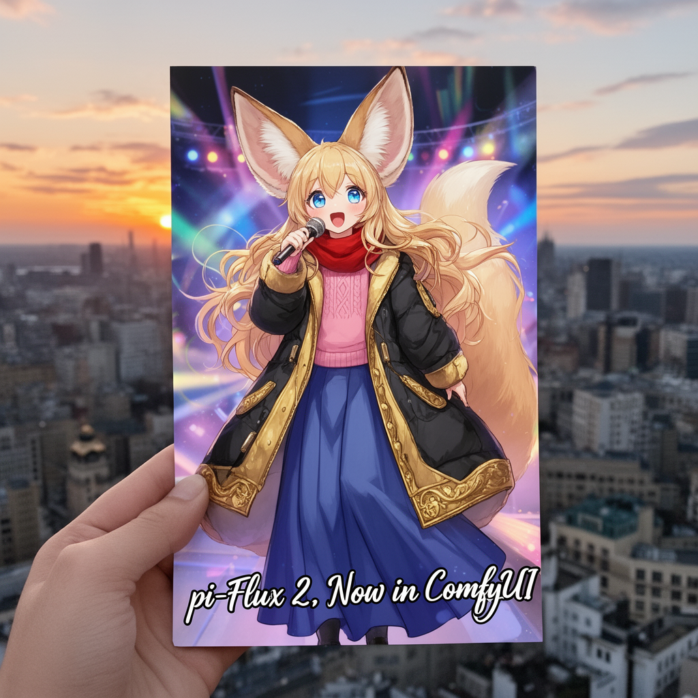

# ComfyUI pi-Flow Nodes for Fast Few-Step Sampling


**ComfyUI-piFlow** is a collection of custom nodes for [ComfyUI](https://github.com/comfyanonymous/ComfyUI) that implement the pi-Flow few-step sampling workflow. All images in the above example were generated using pi-Flow with only 4 sampling steps.

[pi-Flow](https://arxiv.org/abs/2510.14974) is a novel method for flow-based few-step generation. It achieves both high quality and diversity in generated images with as few as 4 sampling steps. Notably,  pi-Flow’s results generally align with the base model’s outputs and exhibit significantly higher diversity than those from DMD models (e.g., [Qwen-Image Lightning](https://github.com/ModelTC/Qwen-Image-Lightning)), as shown below.


In addition, when using some photorealistic style LoRAs, pi-Flow produces better texture details than DMD models, as shown below (zoom in for best view).


## Installation

**This repo requires ComfyUI version 0.3.64 or higher**. Make sure your ComfyUI is up to date before installing.

### ComfyUI Manager

If you are using [ComfyUI Manager](https://github.com/Comfy-Org/ComfyUI-Manager), you can load a [workflow](#workflows) first, and then install the missing nodes via ComfyUI Manager.

### Manual Installation

For manual installation, simply clone this repo into your ComfyUI `custom_nodes` directory.
```bash
# run the following command in your ComfyUI `custom_nodes` directory
git clone https://github.com/Lakonik/ComfyUI-piFlow
```

## Workflows

This repo provides image generation [workflows](workflows) based on Qwen-Image, FLUX.1 dev, and FLUX.2 dev. 

### pi-Qwen-Image

Currently supports the Qwen-Image text-to-image base model (and possibly some of its customized versions). Qwen-Image-Edit may be supported in the future.

Please download the image below and drag it into ComfyUI to load the pi-Qwen-Image workflow.  


#### Model links

Base model

- Download [qwen_image_fp8_e4m3fn.safetensors](https://huggingface.co/Comfy-Org/Qwen-Image_ComfyUI/resolve/main/split_files/diffusion_models/qwen_image_fp8_e4m3fn.safetensors) and save it to
<br>`models/diffusion_models/qwen_image_fp8_e4m3fn.safetensors`

  Alternative scaled FP8 version: [qwen_image_fp8_e4m3fn_scaled.safetensors](https://huggingface.co/lightx2v/Qwen-Image-Lightning/resolve/main/Qwen-Image/qwen_image_fp8_e4m3fn_scaled.safetensors)

pi-Flow adapter

- Download [gmqwen_k8_piid_4step/diffusion_pytorch_model.safetensors](https://huggingface.co/Lakonik/pi-Qwen-Image/resolve/main/gmqwen_k8_piid_4step/diffusion_pytorch_model.safetensors) and save it to 
<br>`models/loras/gmqwen_k8_piid_4step.safetensors`

Text encoder

- Download [qwen_2.5_vl_7b_fp8_scaled.safetensors](https://huggingface.co/Comfy-Org/Qwen-Image_ComfyUI/resolve/main/split_files/text_encoders/qwen_2.5_vl_7b_fp8_scaled.safetensors) and save it to
<br>`models/text_encoders/qwen_2.5_vl_7b_fp8_scaled.safetensors`

VAE

- Download [qwen_image_vae.safetensors](https://huggingface.co/Comfy-Org/Qwen-Image_ComfyUI/resolve/main/split_files/vae/qwen_image_vae.safetensors) and save it to
<br>`models/vae/qwen_image_vae.safetensors`

#### Sampler steps

The 4-step adapter works well for any number of sampling steps greater than or equal to 4.

### pi-Flux

Currently supports the FLUX.1 dev text-to-image base model (and possibly some of its customized versions).

Please download the image below and drag it into ComfyUI to load the pi-Flux workflow.  


#### Model links

Base model

- Download [flux1-dev.safetensors](https://huggingface.co/black-forest-labs/FLUX.1-dev/resolve/main/flux1-dev.safetensors) and save it to
<br>`models/diffusion_models/flux1-dev.safetensors`

  Alternative scaled FP8 version: [flux_dev_fp8_scaled_diffusion_model.safetensors](https://huggingface.co/comfyanonymous/flux_dev_scaled_fp8_test/resolve/main/flux_dev_fp8_scaled_diffusion_model.safetensors)

pi-Flow adapter

- Download [gmflux_k8_piid_4step/diffusion_pytorch_model.safetensors](https://huggingface.co/Lakonik/pi-FLUX.1/resolve/main/gmflux_k8_piid_4step/diffusion_pytorch_model.safetensors) and save it to 
<br>`models/loras/gmflux_k8_piid_4step.safetensors`

- Download [gmflux_k8_piid_8step/diffusion_pytorch_model.safetensors](https://huggingface.co/Lakonik/pi-FLUX.1/resolve/main/gmflux_k8_piid_8step/diffusion_pytorch_model.safetensors) and save it to 
<br>`models/loras/gmflux_k8_piid_8step.safetensors`

Text encoder

- Download [clip_l.safetensors](https://huggingface.co/comfyanonymous/flux_text_encoders/resolve/main/clip_l.safetensors) and save it to
<br>`models/text_encoders/clip_l.safetensors`

- Download [t5xxl_fp16.safetensors](https://huggingface.co/comfyanonymous/flux_text_encoders/resolve/main/t5xxl_fp16.safetensors) and save it to
<br>`models/text_encoders/t5xxl_fp16.safetensors`

VAE

- Download [ae.safetensors](https://huggingface.co/black-forest-labs/FLUX.1-schnell/resolve/main/ae.safetensors) and save it to
<br>`models/vae/ae.safetensors`

#### Sampler steps

Use gmflux_k8_piid_4step.safetensors for 4-step sampling and gmflux_k8_piid_8step.safetensors for 8-step sampling. Using other settings may result in amplified or reduced contrast, which could be re-calibrated by adjusting the `adapter_strength`.

#### Guidance 

The adapters **only work with `guidance` set to 3.5**. Do NOT modify this value, otherwise the results will be very noisy.

### pi-Flux.2

Supports the FLUX.2 dev base model (and possibly some of its customized versions), which enables both text-to-image generation and multi-image editing tasks.

Please download the image below and drag it into ComfyUI to load the pi-Flux.2 workflow.  



#### Model links

Base model

- Download [flux2_dev_fp8mixed.safetensors](https://huggingface.co/Comfy-Org/flux2-dev/resolve/main/split_files/diffusion_models/flux2_dev_fp8mixed.safetensors) and save it to
<br>`models/diffusion_models/flux2_dev_fp8mixed.safetensors`

pi-Flow adapter

- Download [gmflux2_k8_piid_4step/diffusion_pytorch_model.safetensors](https://huggingface.co/Lakonik/pi-FLUX.2/resolve/main/gmflux2_k8_piid_4step/diffusion_pytorch_model.safetensors) and save it to 
<br>`models/loras/gmflux2_k8_piid_4step.safetensors`

Text encoder

- Download [mistral_3_small_flux2_fp8.safetensors](https://huggingface.co/Comfy-Org/flux2-dev/resolve/main/split_files/text_encoders/mistral_3_small_flux2_fp8.safetensors) and save it to
<br>`models/text_encoders/mistral_3_small_flux2_fp8.safetensors`

VAE

- Download [flux2-vae.safetensors](https://huggingface.co/Comfy-Org/flux2-dev/resolve/main/split_files/vae/flux2-vae.safetensors) and save it to
<br>`models/vae/flux2-vae.safetensors`

#### Sampler steps

The 4-step adapter works well for any number of sampling steps greater than or equal to 4.

#### Guidance 

The adapter **only works with `guidance` set to 4.0**. Do NOT modify this value.

## GGUF Support

To load GGUF models, please install the custom nodes in [ComfyUI-GGUF](https://github.com/city96/ComfyUI-GGUF) first. 

Then, replace the `Load pi-Flow Model` node in the workflows with the `Load pi-Flow Model (GGUF)` node and select the corresponding GGUF model file.

## Training Your Own pi-Flow Models

Please visit the official [piFlow](https://github.com/lakonik/piflow) repo for more information on training.

## License

This code repository is licensed under the Apache-2.0 License. Models used in the workflows are subject to their own respective licenses.

## Changelog

- **v1.1.5** (2026-01-18)
  - Fix a compatibility issue with ComfyUI-GGUF commit `58625e1`.
  - Add support for loading metadata from GGUF pi-Flow models.

- **v1.1.4** (2025-12-18)
  - Fix a bug in the example pi-Flux.2 editing workflow where a load image node is disconnected from the main graph. 

- **v1.1.3** (2025-12-18)
  - Add pi-Flux.2 models and workflow for text-to-image generation and multi-image editing.
  - Add GGUF support for pi-Flow models.
  - Fix compatibility for ComfyUI v0.4.0 (new quantization)
  - Fix dtype mismatch issues in GMFlow output layers
  - Improve GMFlow numerical stability

- **v1.0.5** (2025-11-11)
  - Add experimental support for polynomial-based DX policy.
  - Update README.md and pi-Flux workflow (highlighting the FluxGuidance setting).

- **v1.0.4** (2025-11-09)
  - Fix a bug in GM-Qwen when running in BF16 precision.

- **v1.0.3** (2025-11-09)
  - Add support for scaled FP8 base models.