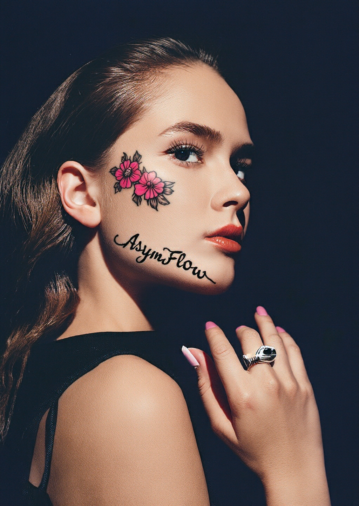
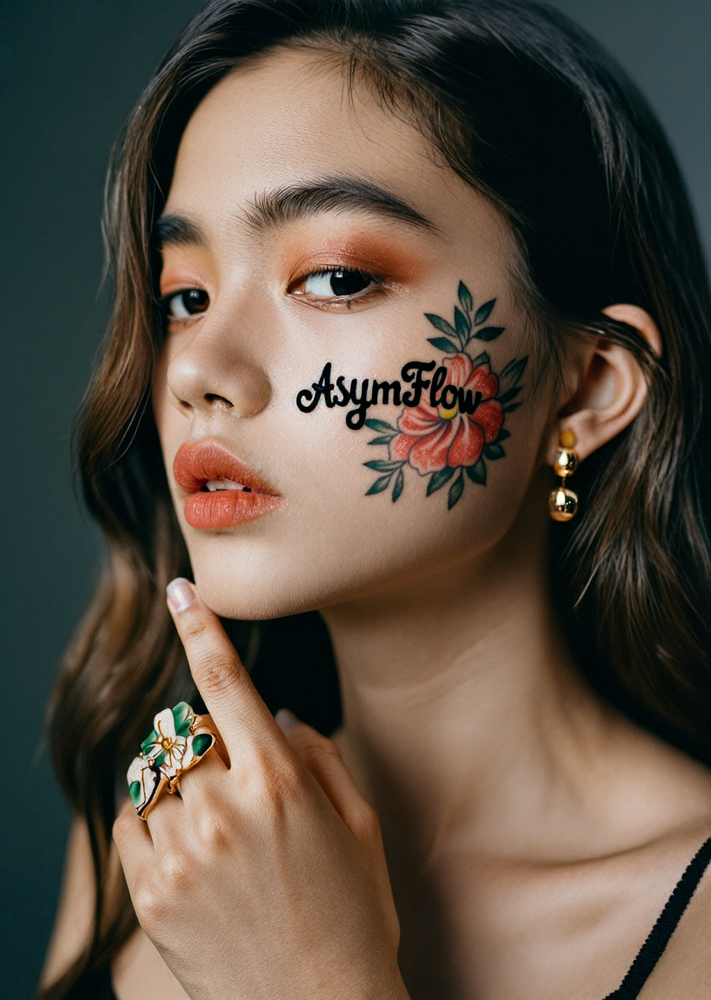
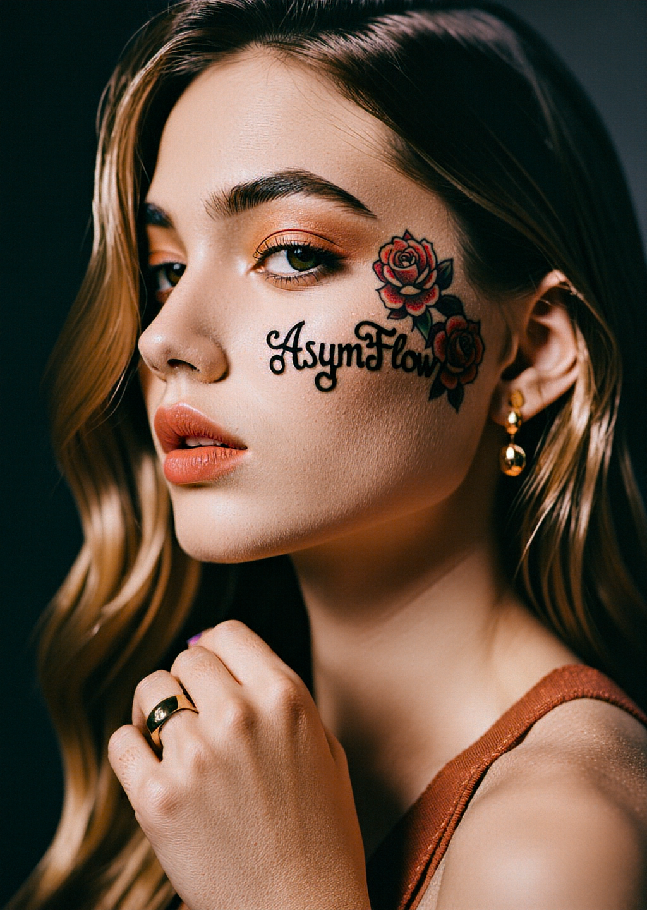

# AsymFlow Models for Pixel-Space Generation

## Workflows

This repo provides image generation [workflows](../workflows) based on FLUX.2 klein Base 9B.

### AsymFLUX.2 klein 9B

AsymFLUX.2 klein 9B is an adapter that converts FLUX.2 klein Base 9B into a pixel-space AsymFlow model for text-to-image generation.

We provide three variants of the adapter:

- **AsymFLUX.2 klein 9B**
  
  The base adapter, trained on a LAION subset for 15k steps (batch size=256).
  - The most raw, realistic and versatile model.
  - Results are highly diverse and creative.
  - Minimal aesthetic bias. Requires careful prompting to achieve certain styles.
  - Text rendering and anatomy (e.g., fingers) are not very good, since the original model (FLUX.2 klein Base 9B) is not good at these aspects.

  Please download the image below and drag it into ComfyUI to load the workflow.  

  

- **AsymFLUX.2 klein 9B SFT Z-Image Turbo**

  Finetuned on synthetic data generated by Z-Image Turbo for 500 steps (batch size=192).
  - Results are less diverse.
  - Text rendering and anatomy (e.g., fingers) are more stable due to reduced diversity.
  - Styles are more consistent and less sensitive to prompt changes.

  Please download the image below and drag it into ComfyUI to load the workflow.

  

- **AsymFLUX.2 klein 9B SFT FLUX.2 klein**

  Finetuned on synthetic data generated by FLUX.2 klein Ditilled 9B for 500 steps (batch size=192).
  - Results are less diverse.
  - Text rendering and anatomy (e.g., fingers) are more stable due to reduced diversity.
  - Styles are more consistent and less sensitive to prompt changes.

  Please download the image below and drag it into ComfyUI to load the workflow.

  

#### Model links

**Base model**

- Download [flux-2-klein-base-9b-fp8.safetensors](https://huggingface.co/black-forest-labs/FLUX.2-klein-base-9b-fp8/resolve/main/flux-2-klein-base-9b-fp8.safetensors) and save it to
 `models/diffusion_models/flux-2-klein-base-9b-fp8.safetensors`

**AsymFlow adapters**

- Download [AsymFLUX.2-klein-9B/diffusion_pytorch_model.safetensors](https://huggingface.co/Lakonik/AsymFLUX.2-klein-9B/resolve/main/diffusion_pytorch_model.safetensors) and save it to 
 `models/loras/asymflux2_klein_9b.safetensors`
- Download [AsymFLUX.2-klein-9B-collection/asymflux2_klein_9b_sft_flux2_klein/diffusion_pytorch_model.safetensors](https://huggingface.co/Lakonik/AsymFLUX.2-klein-9B-collection/resolve/main/asymflux2_klein_9b_sft_flux2_klein/diffusion_pytorch_model.safetensors) and save it to 
 `asymflux2_klein_9b_sft_flux2_klein.safetensors`
- Download [AsymFLUX.2-klein-9B-collection/asymflux2_klein_9b_sft_zimage_turbo/diffusion_pytorch_model.safetensors](https://huggingface.co/Lakonik/AsymFLUX.2-klein-9B-collection/resolve/main/asymflux2_klein_9b_sft_zimage_turbo/diffusion_pytorch_model.safetensors) and save it to 
 `asymflux2_klein_9b_sft_zimage_turbo.safetensors`

**Text encoder**

- Download [qwen_3_8b_fp8mixed.safetensors](https://huggingface.co/Comfy-Org/flux2-klein-9B/resolve/main/split_files/text_encoders/qwen_3_8b_fp8mixed.safetensors) and save it to
 `models/text_encoders/qwen_3_8b_fp8mixed.safetensors`

## GGUF Support

To load GGUF models, please install the custom nodes in [ComfyUI-GGUF](https://github.com/city96/ComfyUI-GGUF) first. 

Then, replace the `Load AsymFlow Model` node in the workflows with the `Load AsymFlow Model (GGUF)` node and select the corresponding GGUF model file.

## Live pixel preview

AsymFlow workflows support precise previews of the generation process. Launch ComfyUI with the arguments `--preview-method auto --preview-size 1024` to enable live pixel preview.

